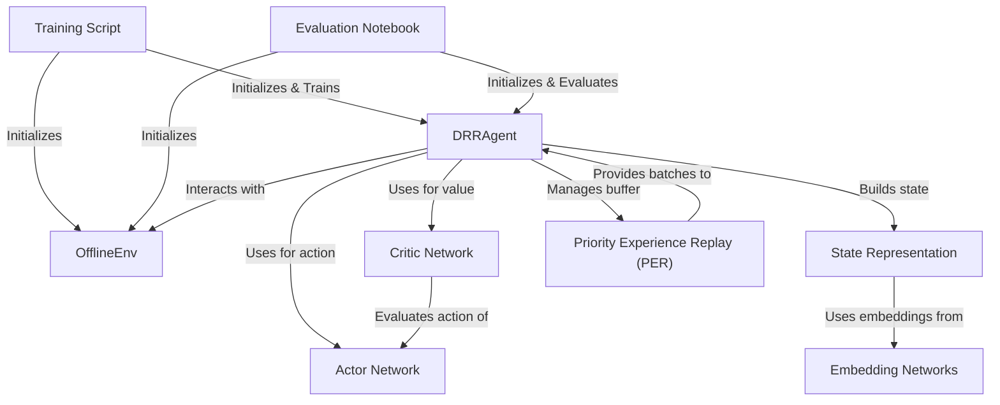

# Deep Reinforcement Learning for Recommendation

A high-fidelity TensorFlow implementation of a recommender system powered by Deep Deterministic Policy Gradient (DDPG), based on
**Liu et al., "Deep Reinforcement Learning-based Recommendation with Explicit User-Item Interactions Modeling" (arXiv:1810.12027)**
This version integrates performance-oriented modifications and state representation learning.

## Overview

## Objectives
- Model long-term user engagement using an Actor-Critic DRL framework ✅
- Integrate explicit user-item interaction for enhanced reward feedback ✅ 
- Achieve scalable, policy-based recommendation on implicit datasets ✅
- Ensure TensorFlow 2.x compatibility for rapid experimentation ✅

## Intuition 
Traditional recommender systems rely heavily on static supervised learning methods that fail to capture sequential user behavior and long-term engagement. However, recommendation is inherently a sequential decision-making problem—what you suggest now affects future user interactions.

This project reframes the task as a Markov Decision Process (MDP), where:
- The state represents user preferences and interaction history,
- The action is the recommended item,
- The reward is user feedback (click, watch, rating),
- The policy evolves dynamically to maximize cumulative rewards.

We implement an Actor-Critic architecture because:
- The Actor learns the policy (what to recommend),
- The Critic evaluates that policy (was it a good recommendation?),
- Together, they enable stable, sample-efficient learning even with sparse or delayed feedback—common in recommendation settings.

This design outperforms static models by continuously adapting to users, enabling the system to learn personalized, long-term optimal strategies, not just one-off predictions.

## Result
| Metric        | @5     | @10    |
|---------------|--------|--------|
| Precision     | 0.479  | 0.444  |
| NDCG          | 0.471  | 0.429  |
| Reward Gain   | \> 17.3% over baseline | — |
| Training Time | \~42 min (RTX 3050 - 4GB VRAM) | — |

## References 
Research Paper link - https://arxiv.org/pdf/1810.12027
 
Dataset Link - https://github.com/leovidith/DRL-Recommender-TF/tree/main/data

